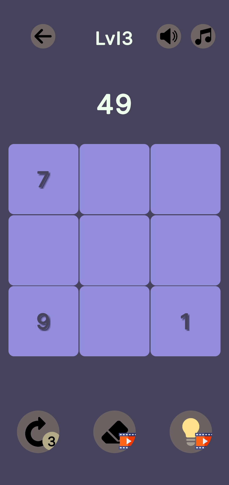
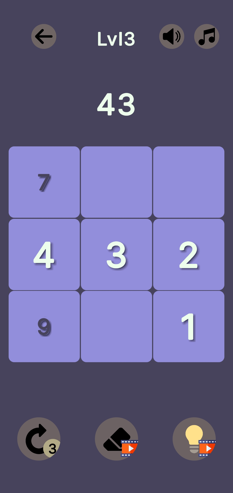
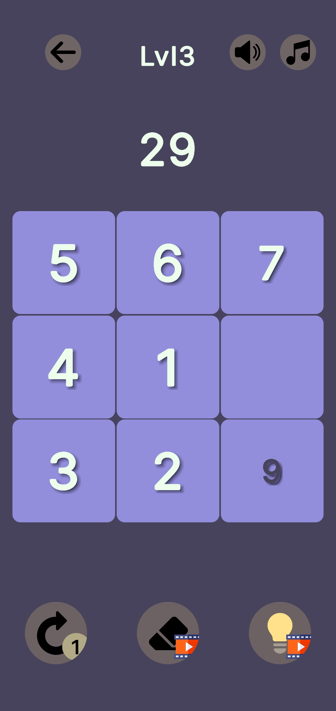
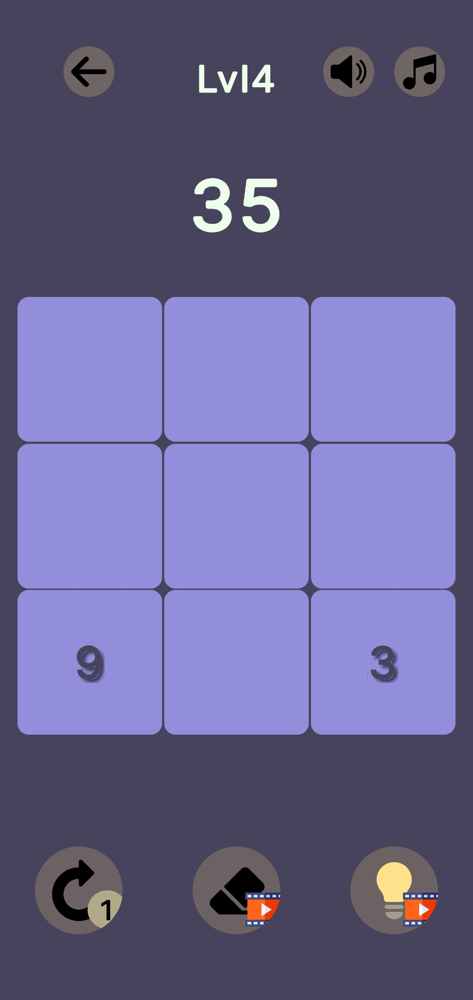
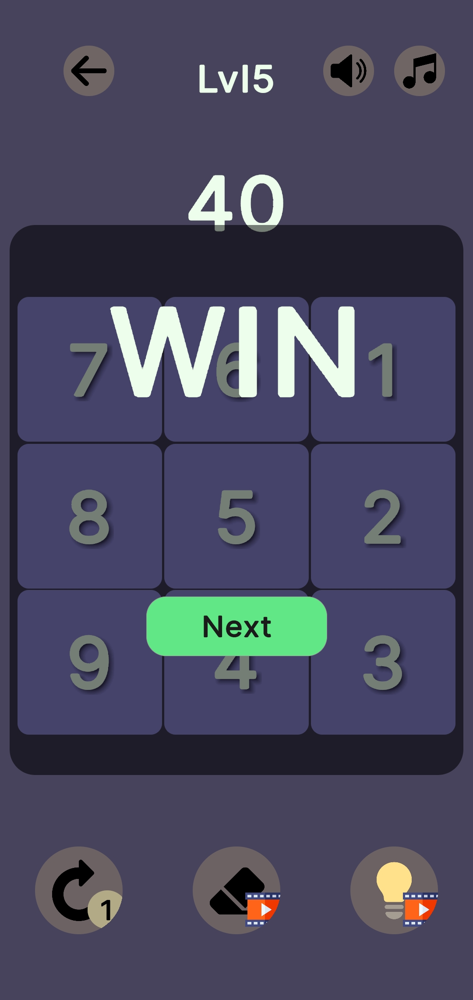
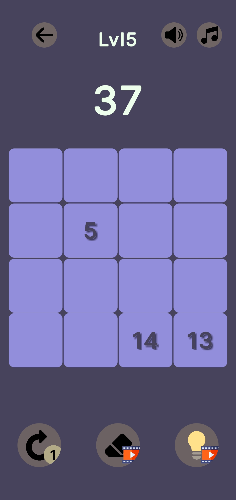

<div align="center">
  
  <h1>Count</h1>
  <p><strong>A quick-thinking number-path puzzle.</strong></p>
  <p>Find the route. Follow the numbers. Beat the clock.</p>
</div>

---

## Screenshots

<p align="center">
  
  
  
</p>
<p align="center">
  
  
  
</p>

## The game

Count is a grid-based puzzle game about building a path one number at a time. Start anywhere, then move **up, down, left, or right** to place the next number. Work around the clues, reach the final number, and complete the board without repeating a number.

Each round generates a new path and places a small set of numbered clues on the board. Read the grid, plan your route, and see how far you can get.

## Game modes

- **Competitive** — race the clock, solve consecutive boards, and build your high score.
- **Career** — play without the countdown and progress through increasingly varied boards.
- **Practice** — revisit unlocked difficulty levels.

Boards begin at 3×3, grow to 4×4, and later vary in size from 3×3 to 6×6. In Competitive mode, each solved board adds time to the clock.

## Built with

- **Unity 6** (`6000.0.29f1`)
- **C#**
- **UI Toolkit** (UXML and USS)
- **Google Mobile Ads Unity plugin**

## Play from the Unity Editor

1. Install Unity Hub and Unity Editor `6000.0.29f1`.
2. In Unity Hub, select **Add project from disk** and choose this repository.
3. Open the project and allow Unity Package Manager to resolve its packages.
4. Open `Assets/Scenes/SampleScene.unity`.
5. Press **Play**.

`SampleScene` is the scene enabled in the project's build settings. To create a device build, choose and configure the desired platform in Unity's build settings first. Live ads require the appropriate Google Mobile Ads app and ad-unit configuration.

## How it works

The board is generated at runtime: the game creates a grid, finds a non-repeating orthogonal route through it, and reveals selected positions as clues. The player builds the sequence by clicking adjacent cells, while the game checks the move order and prevents duplicate numbers.

The gameplay UI is built with UI Toolkit. Separate managers handle board generation, game flow, audio, timing, and rewarded-ad integration. Competitive high scores are saved locally with Unity `PlayerPrefs`.

## Project structure

```text
Assets/
├── Scenes/                  Unity scenes
└── _ProjectAssets/
    ├── Audio/               Music and sound effects
    ├── Data/                Tutorial data
    ├── Scripts/             Board, game, timer, audio, and ad logic
    ├── T/                   Logo and visual assets
    └── UI/                  UI Toolkit layouts and styles
```
